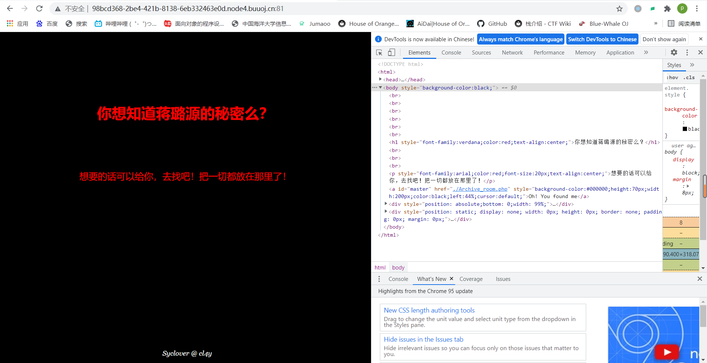

<!-- more -->

🍊

f12发现一个php文件，冲！

又一个php文件！事情开始往好的方向发展了！

？

坏起来了。

action.php直接跳到了end.php，闪那么快那不得抓个包？

发现一个被隐藏起来的php，进入

发现flag被放在了flag.php里

但是好几个符号都被过滤掉了，想起之前学的filter用base64输出，构造payload：http://98bcd368-2be4-421b-8138-6eb332463e0d.node4.buuoj.cn:81/secr3t.php?file=php://filter/read=convert.base64-encode/resource=flag.php

base64解码一下，得到flag

flag{ad5cf93f-7051-4c74-9f92-948187887449}